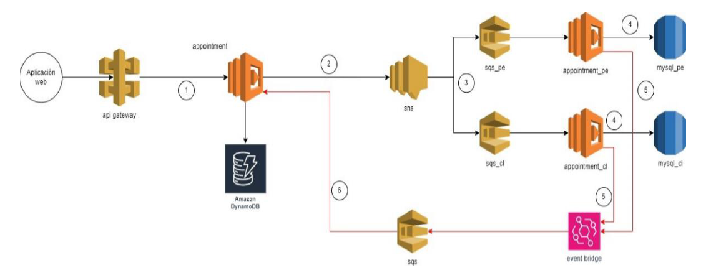

# 📌 API Appointment

Nombre autoexplicativo del proyecto, con una breve descripción clara y directa de lo que hace.


---

## 🧠 Descripción

La **Appointment API** es un servicio RESTful diseñado para gestionar las citas de personas aseguradas. Esta API permite crear, recuperar y administrar citas a través de identificadores únicos (ID) de asegurados.

---

## 🖼️ Visuales


  

---

## 🚀 Empezando

Estas instrucciones te guiarán para obtener una copia de este proyecto en funcionamiento en tu máquina local para propósitos de desarrollo y pruebas.

### 📋 Lenguajes y Dependencias del Proyecto


Lenguaje Principale:

- TypeScript v5.9.3

Dependencias de Desarrollo:

- @types/aws-lambda: ^8.10.156
- @types/jest: ^30.0.0
- @types/node: ^24.9.1
- jest: ^30.2.0
- serverless-esbuild: ^1.52.1
- serverless-offline: ^12.0.4
- serverless-plugin-typescript: ^2.1.5
- ts-jest: ^29.4.5
- ts-node: ^10.9.2

Dependencias de Producción:

- @aws-sdk/client-dynamodb: ^3.917.0
- @aws-sdk/client-sns: ^3.917.0
- @aws-sdk/lib-dynamodb: ^3.917.0
- aws-lambda: ^1.0.7
- mysql2: ^3.15.3

### 🔧 Guía de Instalación del Proyecto

Requisitos Previos:

1. Node.js: v18 o superior
2. npm: v9 o superior
3. AWS CLI: Configurado con credenciales
4. Serverless Framework: Instalación global recomendada

Pasos de Instalación:

```bash
# Paso 1: Clonar el repositorio
git clone https://github.com/JohelTec/app-appointment.git

# Paso 2: Entrar al directorio
cd app_appointment

# Paso 3: Instalar dependencias
npm install

# Paso 5: Despliege en AWS
npm run deploy

```

---

## 🧪 Ejecutando las Pruebas

```bash
# Ejecutar todas las pruebas

npm run test
npm run test:watch
npm run test:coverage
```

## 📦 Despliegue

Para desplegar este proyecto en un entorno:

- Crear dos base de datos MYSQL
    ```bash
        # Credenciales
        DB_HOST: xxxxxxx
        DB_USER: xxxxxxx
        DB_PASSWORD: xxxxx
        DB_NAME: appointments_pe

        # SQL creación de base da datos
        CREATE DATABASE appointments_pe;

        # SQL creación de tabla
        CREATE TABLE appointments (
            id BIGINT AUTO_INCREMENT PRIMARY KEY,
            insured_id VARCHAR(20) NOT NULL,        -- ID del asegurado (ej: "00007")
            schedule_id INT NOT NULL,               -- ID de la agenda o turno
            center_id INT NOT NULL,                 -- ID del centro médico
            specialty_id INT NOT NULL,              -- ID de la especialidad
            medic_id INT NOT NULL,                  -- ID del médico
            appointment_date DATETIME NOT NULL,     -- Fecha y hora (en UTC o local)
            country_iso CHAR(2) NOT NULL,           -- Código de país ISO (ej: "CL")
            created_at TIMESTAMP DEFAULT CURRENT_TIMESTAMP,
            updated_at TIMESTAMP DEFAULT CURRENT_TIMESTAMP ON UPDATE CURRENT_TIMESTAMP
        );

    ```

    ```bash
         # Credenciales
        DB_HOST: xxxxxxx
        DB_USER: xxxxxxx
        DB_PASSWORD: xxxxx
        DB_NAME: appointments_cl

        # SQL creación de base da datos
        CREATE DATABASE appointments_cl;

        # SQL creación de tabla
        CREATE TABLE appointments (
            id BIGINT AUTO_INCREMENT PRIMARY KEY,
            insured_id VARCHAR(20) NOT NULL,        -- ID del asegurado (ej: "00007")
            schedule_id INT NOT NULL,               -- ID de la agenda o turno
            center_id INT NOT NULL,                 -- ID del centro médico
            specialty_id INT NOT NULL,              -- ID de la especialidad
            medic_id INT NOT NULL,                  -- ID del médico
            appointment_date DATETIME NOT NULL,     -- Fecha y hora (en UTC o local)
            country_iso CHAR(2) NOT NULL,           -- Código de país ISO (ej: "CL")
            created_at TIMESTAMP DEFAULT CURRENT_TIMESTAMP,
            updated_at TIMESTAMP DEFAULT CURRENT_TIMESTAMP ON UPDATE CURRENT_TIMESTAMP
        );
    ```

---


## 📚 API Endpoints

### Base URL
```
https://9d3t3hh0qj.execute-api.us-east-1.amazonaws.com/appointment
```
### 1. Registrar Cita

**POST** `/appointment`

Registra una nueva cita para un asegurado.

#### Request Body
```json
{
  "insuredId": "0001",              -- ID del asegurado (ej: "00007")
  "scheduleId": 100,                -- ID de la agenda o turno
  "centerId": 4,                    -- ID del centro médico
  "specialtyId": 3,                 -- ID de la especialidad
  "medicId": 4,                     -- ID del médico
  "date": "2024-09-30T12:30:00Z",   -- Fecha y hora (en UTC o local)
  "countryISO": "PE",               -- Código de país ISO (ej: "CL")
  "status": "pending"               -- Estado de registro
}
```

#### Response Success (200)
```json
{
  "message":"Se generado la solicitud de la cita"
}
```


### 2. Consultar Citas por Asegurado

**GET** `/appointment/{insuredId}`

Obtiene todas las citas de un asegurado específico.

#### Response Success (200)
```json
{
    "centerId": 4,
    "countryISO": "PE",
    "date": "2024-09-30T12:30:00Z",
    "insuredId": "00058",
    "medicId": 4,
    "scheduleId": 100,
    "specialtyId": 3,
    "status": "completed"
}
```


## 📌 Versionado

 
        Branch: main


---

## ✒️ Autores

    Johnny Flores Inga

---

